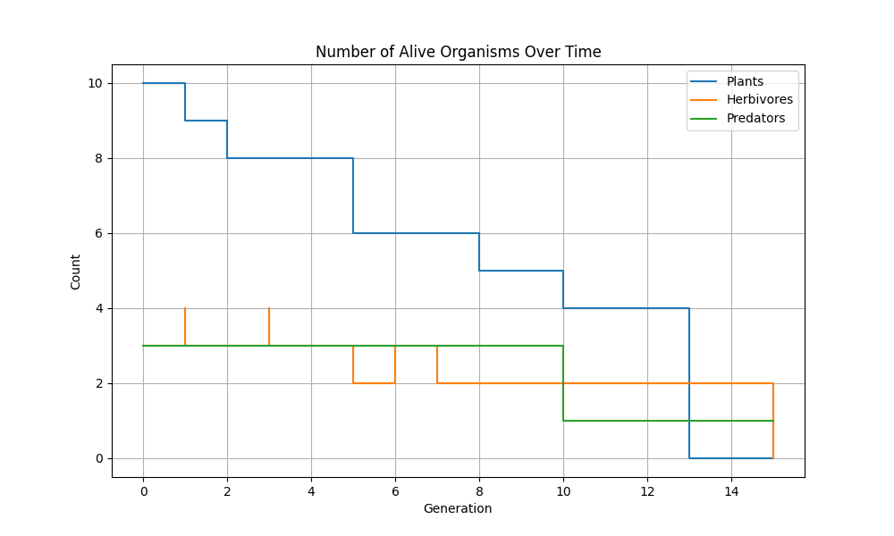
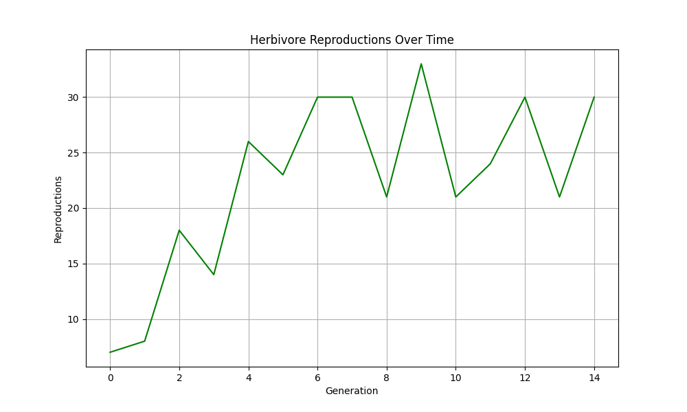
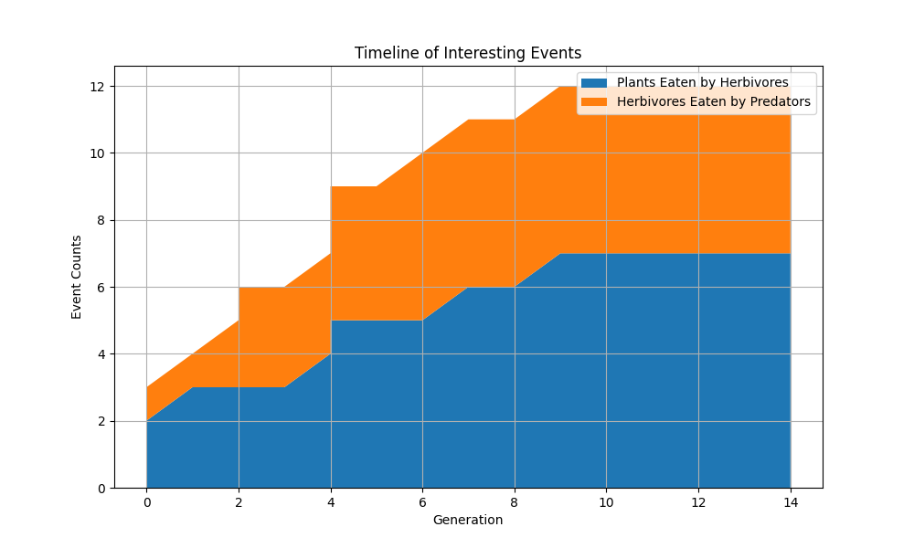

# Ecosystem Simulation Game

This project is a Python-based simulation of an ecosystem, modeling interactions between plants, herbivores, and predators. The simulation operates on a 2D grid, where organisms interact based on predefined rules, reproduce, and survive. The game collects data during the simulation and generates visual statistics to analyze ecosystem behavior over time.

## Features

- **Organism Types**: Simulates plants, herbivores, and predators, each with unique behavior.
- **Data Collection**: Tracks events (e.g., deaths, reproductions, eating events) and population counts across generations.
- **Visual Statistics**: Automatically generates plots after the simulation to visualize population dynamics, reproduction rates, and event timelines.
- **Customizable Configurations**:
  - Define simulation grid size, organism types, and rules in YAML configuration files.
  - Start with pre-defined patterns or create your own.
- **Logging**: Logs simulation events to files for further analysis.

## Project Structure

```
.
├── cells/                    # Contains classes for different organism types and a factory for creating them.
├── config/                   # YAML configuration files for simulation and cell logic.
├── consts/                   # Constants used in the simulation.
├── data/                     # Collected data for each simulation run.
├── data_collector/           # Data collection and observation implementation.
├── enums/                    # Enums for cell types, events, etc.
├── game_manager/             # Core game logic, including the grid and game manager.
├── input/                    # Predefined patterns for the initial grid.
├── logger/                   # Logging implementation.
├── observers/                # Observers for logging and data collection.
├── output/                   # Generated statistics and plots for the simulation.
├── gol_basic_simulation.py   # Entry point to run the simulation.
└── README.md                 # Project documentation.
```

## Getting Started

### Prerequisites

- Python 3.8 or higher
- Install dependencies with `pip`:
  ```bash
  pip install -r requirements.txt
  ```

### Running the Simulation

1. Clone the repository:
   ```bash
   git clone https://github.com/liav2002/2DSim
   cd 2DSim
   ```

2. Start the simulation:
   ```bash
   python gol_basic_simulation.py
   ```

3. Follow the prompts in the terminal to observe the simulation.

### Configuration

Modify the YAML files in the `config/` folder to customize the simulation:
- `game_config.yaml`: Set grid size, total generations, delays, etc.
- `cell_logic_config.yaml`: Define behavior and reproduction rules for organisms.

You can also edit the initial patterns in `input/patterns.yaml` to control the starting grid.

### Outputs

- **Data Files**: Located in the `data/` folder. Each simulation run generates a unique timestamped folder containing:
  - `generation_status.csv`: Tracks organism counts per generation.
  - `events.csv`: Logs events (e.g., reproductions, deaths).
- **Logs**: Saved in the `logs/` folder with timestamps.
- **Statistics**: Generated plots saved in the `output/` folder.

### Example Outputs

#### 1. Number of Alive Organisms Over Time


#### 2. Herbivore Reproductions Over Time


#### 3. Timeline of Interesting Events


## Extending the Project

1. Add new organism types by creating a class in the `cells/` folder and updating the `CellFactory`.
2. Add new events or behaviors by modifying the `Grid` or `Game` classes.
3. Customize data collection and statistics in the `data_collector/` folder.

## License

This project is licensed under the MIT License.

## Author

Developed by [Liav Ariel](https://github.com/liav2002).
